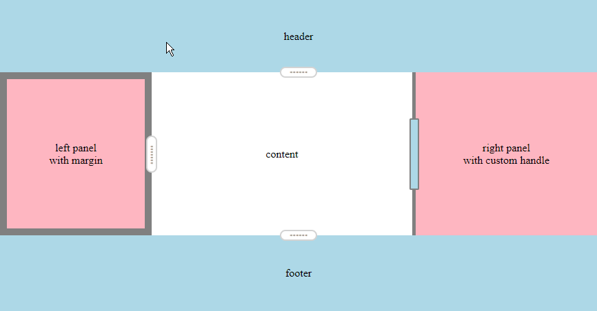

# react-resize-panel

A very simple resizable panel as a React component. Demo [here](https://bjgrosse.github.io/react-resize-panel/demo/public/index.html). 



```js
<ResizePanel direction="e">
<div className="panel sidebar">left panel</div>
</ResizePanel>
```

## Getting started

Install the package:

```bash
yarn install react-resize-panel
```

Import component:

```javascript
import ResizePanel from "react-resize-panel";
```

Wrap the DIV you want to make resizable:

```js
<ResizePanel direction="e">
    <div className="panel sidebar">left panel</div>
</ResizePanel>
```

The direction prop specifies which edge of the panel has the resize handle and whether the panel can be resized vertically or horizontally. Accepted values are: n | s | e | w.

Custom CSS classes can be specified for the resize handle and border:

```js
<ResizePanel direction="e" handleClass="customHandle" borderClass="customResizeBorder">
    <div className="panel sidebar">left panel</div>
</ResizePanel>
```

## Notes
Tests on all modern browsers performed via BrowserStack.

[](https://browserstack.com)

## License

[MIT](LICENSE).
